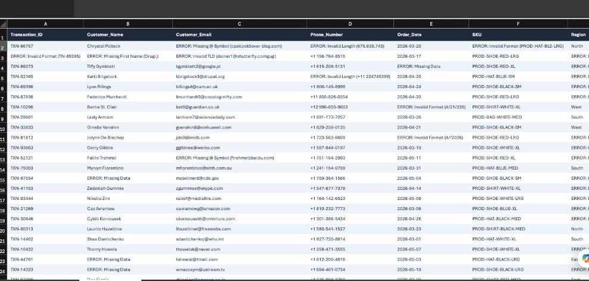
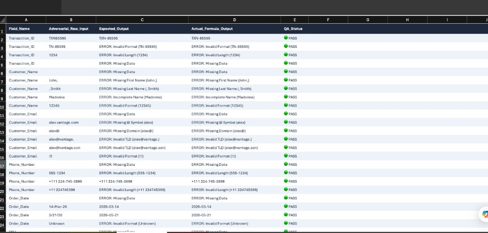

# Data Remediation Engine

**A formula-driven Excel validation engine that takes a messy retail transaction export and produces an audited, analysis-ready dataset.**

Part of the [AlexVantage](https://alexvantage.com) Excel Asset Suite

---

## Problem
Raw operational exports (CRM extracts, Shopify dumps, manual staff entry) arrive full of structural defects: malformed IDs, mixed-case emails, out-of-vocabulary categories, negative revenue, and missing fields. Pushed downstream untouched, this data corrupts reports and breaks analytics pipelines. 

The usual fix is manually eyeballing rows. That doesn't scale, isn't repeatable, and destroys the audit trail.

## Approach
Built a completely isolated staging environment in Excel. Instead of dragging formulas down thousands of rows, this engine uses spilling `MAP` arrays and custom `LAMBDA` functions defined in the Name Manager to run logic checks down entire columns simultaneously.

## What It Does
- **Automated Validation:** Runs incoming records through 11 custom validation functions, replacing invalid values with explicit reason codes (e.g., `ERROR: Invalid TLD`).
- **Dynamic De-duplication:** Uses a custom `KeepRows` function to identify duplicate records based on full-row string concatenation, keeping the first instance for the audit trail rather than blindly deleting it.
- **Multi-Stage Email Parsing:** Strips non-printable characters, collapses duplicate `@` symbols, splits the domain, and cross-references the extension against a master IANA top-level domain table.
- **Regex Auto-Repair:** Uses pattern matching to automatically rebuild malformed SKUs (e.g., restoring missing hyphens to `PRODSHIRTREDLRG`) and standardizes international phone formats.

## Tech Stack
- Microsoft Excel
- Dynamic Arrays (`MAP`, `LAMBDA`, `LET`, `FILTER`)
- Regex matching (via Excel string manipulation equivalents)

## Screenshots

*(Staging layer intercepting bad records and throwing explicit error codes)*

*(Self-testing harness scoring adversarial inputs against the engine's logic)*

## Impact
Stops bad data at the intake layer. Saves hours of manual cell-scrubbing and prevents cascading `#VALUE!` errors in downstream executive reporting.

## Files
- `AlexVantage_Data_Remediation_Engine.xlsx` — The validation template.
- `/sample_data/shopify_dump_dirty.csv` — Adversarial input dataset used for testing.
